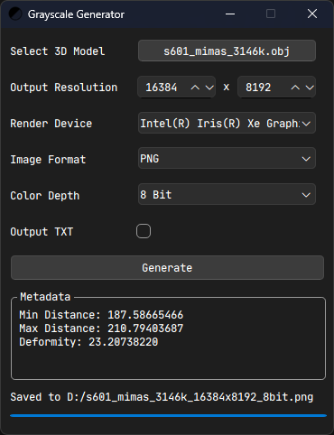
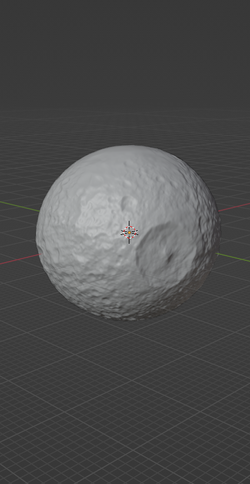
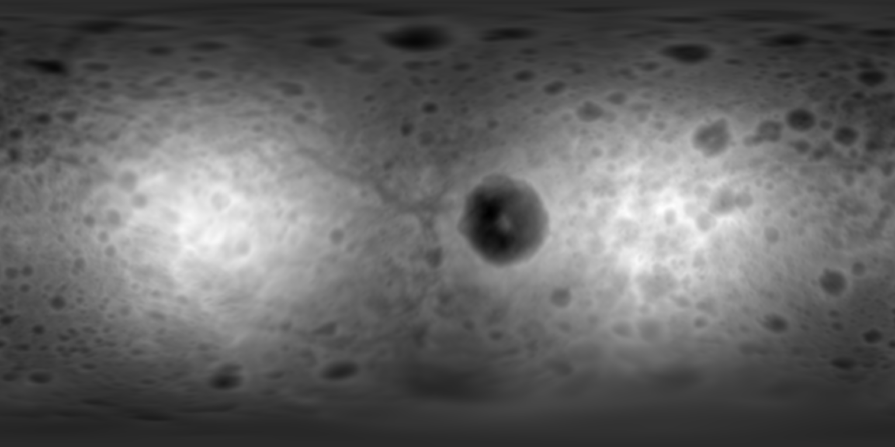

# Grayscale Generator
Grayscale Generator is a tool to generate grayscale maps for 3D models. Specifically, it calculates the distance of each point on the surface relative to the origin point, and converts the result to an image using spherical projection. This project aims to solve the problem of importing custom celestial bodies into ***Kerbal Space Program***. 

This project uses `Qt` to build the GUI, and uses `OpenCL` to accelerate the computation.

Screenshot:

  

## Example
Grayscale Generator can generate 16384x8192 grayscale image **in 30s** for a 3D model with 3 million faces.

   

Result Image:

  

## How to Use
1. Click "Select" button to select a .obj model.
2. Click "Generate".

## Caution
1. The model has to be watertight.
2. Make sure the world origin is inside the model. The intersection rays will emit from the world origin.

## Parameter Explanation
- Output Resolution: The resolution of the output image.
- Render Device: Includes all of the GPUs it detects. The computation will run on the selected GPU.
- Image Format: The format of the output image.
- Color Depth: The color depth of the output image. Note that if you try to output a 16-bit JPG image, it'll still output 8-bit, since JPG format doesn't support 16-bit color depth.
- Output TXT: Check this if you want to get the raw data of distance. Note that the data is stored in column-major order.
