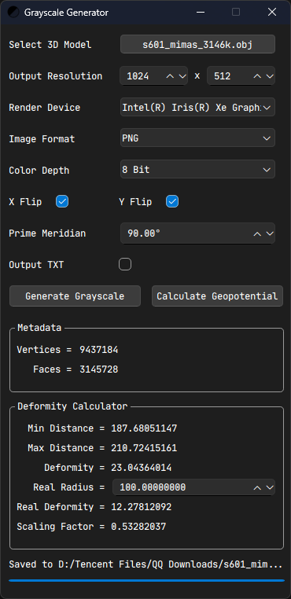

# Grayscale Generator
Grayscale Generator is a tool to generate grayscale maps for 3D models. Specifically, it calculates the distance of each point on the surface relative to the origin point, and converts the result to an image using spherical projection. This project aims to solve the problem of importing custom celestial bodies into ***Kerbal Space Program***. 

It can now calculate geopotential coefficients thanks to [@himisawww](https://github.com/himisawww)'s contribution.

This project uses `Qt 6.7.3` to build the GUI, and uses `OpenCL` to accelerate the computation.

Screenshot:

  

## Example
Grayscale Generator can generate 16384x8192 grayscale image **in 30s** for a 3D model with 3 million faces.

   

Result Image:

  

## How to Use
1. Click "Select" button to select a .obj model.
2. Click "Generate Grayscale" to generate grayscale image, or click "Calculate Geopotential" to calculate geopotential coefficients.

## Caution
1. The model has to be watertight.
2. Make sure the world origin is inside the model. The intersection rays will emit from the world origin.
3. To ensure compatibility with KSP, set the `Prime Meridian` to 90° and enable X & Y Flip. These settings only affect the grayscale image, geopotential is always aligned with the input model and is irrelevant to these settings.

## Parameter Explanation
- Output Resolution: The resolution of the output image.
- Render Device: Includes all of the GPUs it detects. The computation will run on the selected GPU.
- Image Format: The format of the output image.
- Color Depth: The color depth of the output image. Note that JPG format doesn't support 16-bit color depth.
- X Flip: Flip the image horizontally.
- Y Flip: Flip the image vertically.
- Prime Meridian: When generating a grayscale image, a spherical coordinate system is created at the world origin. The azimuth angle is mapped to the x axis of the image, and the pitch angle is mapped to the y axis of the image. The prime meridian refers to the starting direction of the azimuth angle. Specifically, prime meridian 0 corresponds to the positive x axis of the world coordinate system. Changing the prime meridian will change the starting direction of the azimuth angle of the spherical coordinate system, thus changing the horizontal offset of the resulting image.
- Output TXT: Check this if you want to get the raw data of distance. Note that the data is stored in column-major order.
